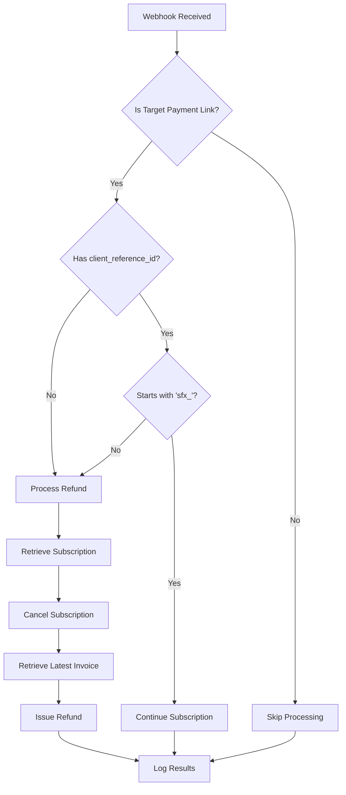

# Stripe Payment Link Auto-Refund Solution

This project provides an automated solution for handling Stripe Payment Link transactions. It automatically refunds charges and cancels subscriptions if a valid `client_reference_id` is not supplied by the customer.

## Overview

The solution listens for Stripe webhook events, specifically the `checkout.session.completed` event. When a transaction is completed for a targeted Payment Link, it checks for the presence and validity of a `client_reference_id`. If the ID is missing or invalid, the system automatically cancels the subscription (if applicable) and issues a refund.

## Features

- Targets specific Stripe Payment Links
- Validates `client_reference_id` with a required prefix
- Automatically cancels subscriptions and issues refunds for invalid transactions
- Provides detailed logging with clickable links to the Stripe Dashboard

## Process Flow

The following diagram illustrates the decision-making process of the webhook handler:


## Setup

1. Clone the repository
1. Install dependencies:
```
npm install
```
3. Set up your environment variables in a .env file:
```
STRIPE_SECRET_KEY=your_stripe_secret_key_here
STRIPE_WEBHOOK_SECRET=your_stripe_webhook_secret_here
```
4. Update the TARGET_PAYMENT_LINKS array in the code with your specific Payment Link IDs
5. Ensure your Stripe webhook is configured to send checkout.session.completed events to your server

## Usage
- Run the Server
```
node app.js
```
The server will start listening for webhook events from Stripe. When a checkout.session.completed event is received for a targeted Payment Link:

If no client_reference_id is provided, or if it doesn't start with 'sfx_', the subscription will be cancelled and a refund will be issued.
If a valid client_reference_id (starting with 'sfx_') is provided, the subscription will continue normally.

## Logging

The solution provides detailed logging, including:

- Full session object details
- Reason for refund (if applicable)
- Subscription cancellation confirmation
- Refund details
- All logs include clickable links to the relevant objects in the Stripe Dashboard for easy investigation and management.

## Dependencies
- express
- stripe
- dotenv
- body-parser

## Contributing
Contributions to improve the solution are welcome. Please feel free to submit a Pull Request.
